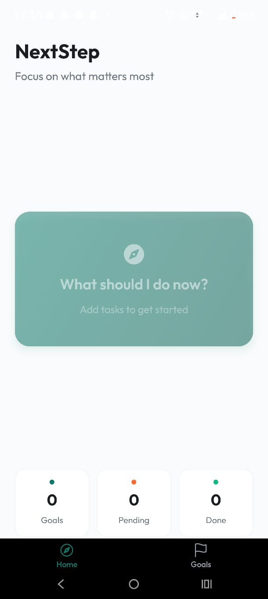

# NextStep 🚀

NextStep is a productivity app that helps users decide **what to do next** by giving one clear, actionable step based on their goals and available time.

Most people aren’t lazy — they’re stuck.  
NextStep removes decision paralysis by suggesting **one meaningful next action** instead of overwhelming task lists.

---

## 🔗 Live Demo (Web Prototype)

👉 https://goal-navigator--aymanchamp.replit.app

> The app has been tested on mobile and works smoothly as a web prototype.

---

## ✨ Features

- 🎯 Goal-focused task suggestions  
- ⏱️ Time-aware recommendations  
- 🧠 One clear next action (no clutter)  
- 📱 Mobile-friendly UI  
- ⚡ Fast and lightweight experience  

---

## 🛠️ Tech Stack

- **React Native**
- **Expo**
- **TypeScript**
- **Node.js**
- **Replit (for deployment & testing)**

---

## 📦 Project Structure
NextStep_app/
├── app/ # App screens and navigation
├── components/ # Reusable UI components
├── assets/ # Images, icons, fonts
├── constants/ # App-wide constants
├── lib/ # Utility functions
├── shared/ # Shared logic
├── server/ # Backend / API logic
├── scripts/ # Utility scripts
├── patches/ # Dependency patches
├── screenshots/ # App screenshots for README
│
├── app.json # Expo configuration
├── package.json # Dependencies and scripts
├── tsconfig.json # TypeScript configuration
├── babel.config.js # Babel configuration
├── metro.config.js # Metro bundler configuration
├── .gitignore
└── README.md

## 📸 Screenshots

> Screenshots taken from the live version of the app.

### Home Screen

### Create Goals

### Select Time & Energy

### Task Suggestions

### Final Recommended Action

🧠 Idea Behind the App

Many productivity apps fail because they overwhelm users with too many choices.

NextStep was built to solve this problem by focusing on decision simplicity — helping users immediately know what to work on next, based on their real-life constraints.

This approach prioritizes progress over perfection.

🔮 Future Improvements

User authentication & saved goals

History of completed actions

Smarter recommendations

Push notifications

Native Android & iOS builds

AI-powered personalization

🙌 Author

Ayman Shaikh
B.Tech – Computer Science & Business Systems

This is my first published app, built to learn, experiment, and solve a real productivity problem.

📄 License

This project is open-source and available under the MIT License.

---

## ✅ FINAL CHECKLIST (YOU’RE ALMOST DONE)

✔ Screenshots folder uploaded  
✔ README polished  
✔ Live demo linked  
✔ Repo structure clean  

Your repo is now **portfolio-ready**, **LinkedIn-ready**, and **recruiter-safe**.

### Next best move (choose one):
1️⃣ Write a **LinkedIn launch post**  
2️⃣ Prepare **Play Store listing**  
3️⃣ Generate **app icon**  
4️⃣ Turn this into an **APK**

Just tell me the number — you’ve done the hard part already 🚀
